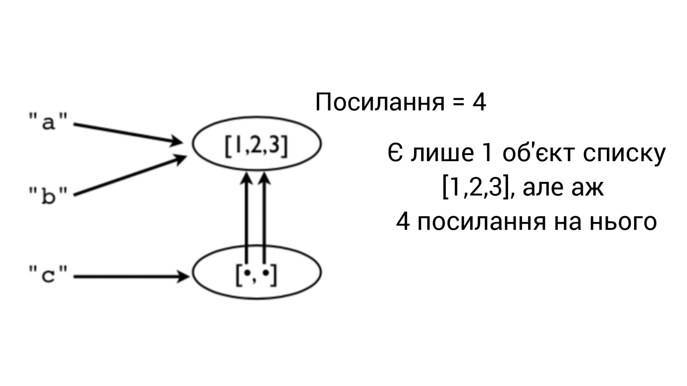
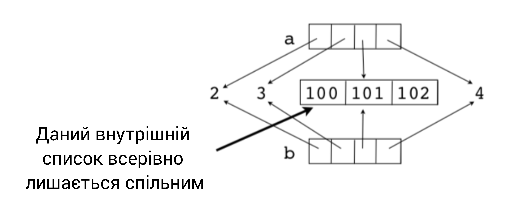

[Зміст](../Contents.md) \| [Попередній розділ (2.6. Компрехенція списку)](06_List_comprehension.md) \| [Наступний розділ (3. Організація програми)](../03_Program_organization/00_Overview.md)

# 2.7 Об'єкти

У цьому розділі наведено додаткові відомості про внутрішню об’єктну модель Python і обговорено деякі питання, пов’язані з керуванням пам’яттю, копіюванням і перевіркою типів.

### Присвоєння

Багато операцій у Python пов’язані з *присвоєнням* або *збереженням* значень.

```python
a = value         # Присвоєння змінній
s[n] = value      # Присвоєння до списку
s.append(value)   # Додавання до списку
d['key'] = value  # Додавання до словника
```

*Застереження: операції призначення **ніколи не створюють копію** присвоюваного значення.* Усі призначення є лише довідковими копіями (або копіями вказівників (pointers), якщо хочете).

### Приклад присвоєння

Розглянемо наступний фрагмент коду.
```python
a = [1,2,3]
b = a
c = [a,b]
```

Зображення основних операцій пам'яті. У цьому прикладі є лише один об’єкт списку `[1,2,3]`, але чотири різні посилання на нього.



Це означає, що зміна значення впливає на *всі* посилання.

```python
>>> a.append(999)
>>> a
[1,2,3,999]
>>> b
[1,2,3,999]
>>> c
[[1,2,3,999], [1,2,3,999]]
>>>
```

Зверніть увагу, як зміни в оригінальному списку відображаються скрізь (упс!). Це тому, що жодних копій ніколи не було зроблено. Усе вказує на одне й те саме значення.

### Перепризначення значень

Перепризначення значення *ніколи* не перезаписує пам’ять, яку використовувало попереднє значення.

```python
a = [1,2,3]
b = a
a = [4,5,6]

print(a)      # [4, 5, 6]
print(b)      # [1, 2, 3]    Утримує оригінальне значення
```

Пам’ятайте: **Змінні – це імена, а не місця в пам’яті.**

### Деякі небезпеки

Якщо ви не знаєте про цю особливість, ви колись вистрелите собі в ногу. Типовий сценарій. Ви змінюєте деякі дані, думаючи, що це ваша особиста копія, і це випадково пошкоджує деякі дані в іншій частині програми.

*Коментар: це одна з причин, чому примітивні типи даних (int, float, string) є незмінними (тільки для читання).*

### Ідентичність та посилання

Використовуйте оператор `is`, щоб перевірити, чи є два значення абсолютно однаковими об’єктами.

```python
>>> a = [1,2,3]
>>> b = a
>>> a is b
True
>>>
```

`is` порівнює ідентичність об’єкта (ціле число). Ідентичність можна отримати за допомогою `id()`.

```python
>>> id(a)
3588944
>>> id(b)
3588944
>>>
```

Примітка. Для порівняння об’єктів майже завжди краще використовувати `==`. Поведінка `is` часто є неочікуваною:
```python
>>> a = [1,2,3]
>>> b = a
>>> c = [1,2,3]
>>> a is b
True
>>> a is c
False
>>> a == c
True
>>>
```
Тому, що `с` - це вже новий об'єкт, який має інше `id`, саме тому `is` і повертає `False`, бо незважаючи на те, що списки однакові - це два різні об'єкти.

### Неглибокі копії

Списки та словники мають методи копіювання.
```python
>>> a = [2,3,[100,101],4]
>>> b = list(a) # Make a copy
>>> a is b
False
```

Це новий список, але елементи списку є спільними.
```python
>>> a[2].append(102)
>>> b[2]
[100,101,102]
>>>
>>> a[2] is b[2]
True
>>>
```

Наприклад, надається спільний доступ до внутрішнього списку `[100, 101, 102]`. Це відомо як поверхнева копія. Ось малюнок.



### Глибокі копії

Іноді потрібно зробити копію об’єкта та всіх об’єктів, які в ньому містяться. Для цього можна використовувати модуль `copy`:
```python
>>> a = [2,3,[100,101],4]
>>> import copy
>>> b = copy.deepcopy(a)
>>> a[2].append(102)
>>> b[2]
[100,101]
>>> a[2] is b[2]
False
>>>
```

### Імена, значення, типи

Імена змінних не мають *типу*. Це лише назва. Однак значення *мають* базовий тип.

```python
>>> a = 42
>>> b = 'Hello World'
>>> type(a)
<type 'int'>
>>> type(b)
<type 'str'>
```

`type()` скаже вам, що є що. Ім'я типу зазвичай використовується як функція, яка створює або перетворює значення в цей тип.

### Перевірка типу

Як визначити, чи є об’єкт певного типу.
```python
if isinstance(a, list):
    print('a is a list')
```

Перевірка одного з багатьох можливих типів.
```python
if isinstance(a, (list,tuple)):
    print('a is a list or tuple')
```

*Увага: не перестарайтеся з перевіркою типу. Це може призвести до надмірної складності коду. Зазвичай ви робите це, лише якщо це запобігатиме поширеним помилкам, які допускають інші користувачі вашого коду.*

### Усе є об'єктом

Числа, рядки, списки, функції, винятки, класи, екземпляри тощо є об’єктами. Це означає, що всі об’єкти, які можна назвати, можна передавати як дані, поміщати в контейнери тощо без будь-яких обмежень. *Особливих* типів об'єктів немає. Іноді кажуть, що всі об'єкти «першокласні».

Простий приклад:
```python
>>> import math
>>> items = [abs, math, ValueError ]
>>> items
[<built-in function abs>,
  <module 'math' (builtin)>,
  <type 'exceptions.ValueError'>]
>>> items[0](-45)
45
>>> items[1].sqrt(2)
1.4142135623730951
>>> try:
        x = int('not a number')
    except items[2]:
        print('Failed!')
Failed!
>>>
```

Тут "items" — це список, що містить функцію, модуль і виняток. Ви можете безпосередньо використовувати елементи зі списку замість оригінальних назв:
```python
items[0](-45)       # abs
items[1].sqrt(2)    # math
except items[2]:    # ValueError
```

З великою силою приходить велика відповідальність. Просто тому, що ви можете таке робити, ще не означає, що ви повинні.

## Exercises

У цьому комплексі вправ ми розглянемо частину потужності, яку надають вам першокласні об’єкти.

### Вправа 2.24: Першокласні дані

У файлі `Data/portfolio.csv` ми читаємо дані, організовані у вигляді стовпців, які виглядають так:

```csv
name,shares,price
"AA",100,32.20
"IBM",50,91.10
...
```

У попередньому коді ми використовували модуль `csv` для читання файлу, але все одно доводилося виконувати перетворення типів вручну. Наприклад:

```python
for row in rows:
    name   = row[0]
    shares = int(row[1])
    price  = float(row[2])
```

Цей вид перетворення також можна виконати більш розумним способом, використовуючи деякі базові операції зі списком.

Створіть список Python, який містить назви функцій перетворення, які ви б використовували для перетворення кожного стовпця у відповідний тип:
```python
>>> types = [str, int, float]
>>>
```

Причина, чому ви навіть можете створити цей список, полягає в тому, що все в Python є *першокласним*. Отже, якщо ви хочете мати список функцій, це окей. Елементи у створеному вами списку є функціями для перетворення значення `x` у певний тип (наприклад, `str(x)`, `int(x)`, `float(x)`).

Тепер прочитайте рядок даних із файлу вище:
```python
>>> import csv
>>> f = open('Data/portfolio.csv')
>>> rows = csv.reader(f)
>>> headers = next(rows)
>>> row = next(rows)
>>> row
['AA', '100', '32.20']
>>>
```

Як зазначалося, цього рядка недостатньо для обчислень, оскільки типи неправильні. Наприклад:
```python
>>> row[1] * row[2]
Traceback (most recent call last):
  File "<stdin>", line 1, in <module>
TypeError: can't multiply sequence by non-int of type 'str'
>>>
```

Однак, можливо, дані можна об’єднати в пару з типами, які ви вказали в `types`. Наприклад:

```python
>>> types[1]
<type 'int'>
>>> row[1]
'100'
>>>
```

Спробуйте перетворити одне зі значень:
```python
>>> types[1](row[1])     # Те ж що і int(row[1])
100
>>>
```

Спробуйте конвертувати інше значення:
```python
>>> types[2](row[2])     # Те ж що і float(row[2])
32.2
>>>
```

Спробуйте обчислення з перетвореними значеннями:
```python
>>> types[1](row[1])*types[2](row[2])
3220.0000000000005
>>>
```

Запакуйте (zipніть) типи стовпців з полями та подивіться на результат:
```python
>>> r = list(zip(types, row))
>>> r
[(<type 'str'>, 'AA'), (<type 'int'>, '100'), (<type 'float'>,'32.20')]
>>>
```

Ви помітите, що це поєднало перетворення типу зі значенням. Наприклад, `int` поєднується зі значенням `'100'`.

Архівований список корисний, якщо потрібно виконати перетворення для всіх значень одне за одним. Спробуйте:

```python
>>> converted = []
>>> for func, val in zip(types, row):
          converted.append(func(val))
...
>>> converted
['AA', 100, 32.2]
>>> converted[1] * converted[2]
3220.0000000000005
>>>
```

Переконайтеся, що ви розумієте, що відбувається в наведеному вище коді. У циклі змінна `func` є однією з функцій перетворення типу (наприклад, `str`, `int` тощо), а змінна `val` є одним із значень, таких як `'AA'`, `'100'`. Вираз `func(val)` перетворює значення (на кшталт касту типу).

Наведений вище код можна стиснути в єдиний рядок за допомогою компрехенції списку.
```python
>>> converted = [func(val) for func, val in zip(types, row)]
>>> converted
['AA', 100, 32.2]
>>>
```

### Вправа 2.25: Створення словників

Пам’ятаєте, як функція `dict()` може легко створити словник, якщо у вас є послідовність назв ключів і значень? Давайте створимо словник із заголовків стовпців:
```python
>>> headers
['name', 'shares', 'price']
>>> converted
['AA', 100, 32.2]
>>> dict(zip(headers, converted))
{'price': 32.2, 'name': 'AA', 'shares': 100}
>>>
```

Звичайно, якщо ваше кунг-фу компрехенції списків уже найвищого рівня, ви можете виконати всі перетворення за один крок за допомогою компрехенції словника:
```python
>>> { name: func(val) for name, func, val in zip(headers, types, row) }
{'price': 32.2, 'name': 'AA', 'shares': 100}
>>>
```

### Вправа 2.26: Загальна картина

Використовуючи техніку в цій вправі, ви зможете писати код, який легко перетворить поля майже з будь-якого файлу даних, орієнтованого на стовпці, у словник Python.

Просто для ілюстрації, припустімо, що ви читаєте дані з іншого файлу даних:
```python
>>> f = open('Data/dowstocks.csv')
>>> rows = csv.reader(f)
>>> headers = next(rows)
>>> row = next(rows)
>>> headers
['name', 'price', 'date', 'time', 'change', 'open', 'high', 'low', 'volume']
>>> row
['AA', '39.48', '6/11/2007', '9:36am', '-0.18', '39.67', '39.69', '39.45', '181800']
>>>
```

Давайте перетворимо поля за допомогою подібного прийому:

```python
>>> types = [str, float, str, str, float, float, float, float, int]
>>> converted = [func(val) for func, val in zip(types, row)]
>>> record = dict(zip(headers, converted))
>>> record
{'volume': 181800, 'name': 'AA', 'price': 39.48, 'high': 39.69,
'low': 39.45, 'time': '9:36am', 'date': '6/11/2007', 'open': 39.67,
'change': -0.18}
>>> record['name']
'AA'
>>> record['price']
39.48
>>>
```

Бонус: як би ви змінили цей приклад, щоб додатково проаналізувати запис `date` у таплі, наприклад `(6, 11, 2007)`?

Витратьте трохи часу на те, щоб усвідомити, що ви зробили під час цієї вправи. Ми повернемося до цих ідей трохи пізніше.

[Зміст](../Contents.md) \| [Попередній розділ (2.6. Компрехенція списку)](06_List_comprehension.md) \| [Наступний розділ (3. Організація програми)](../03_Program_organization/00_Overview.md)
